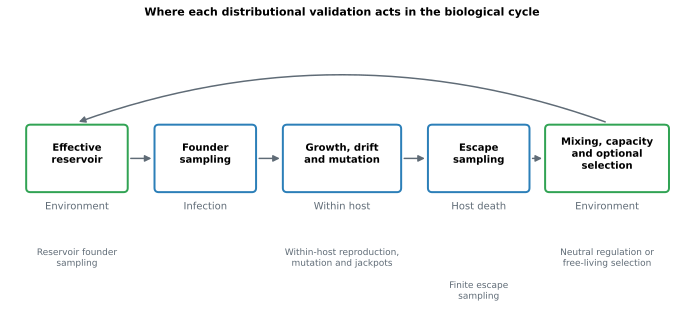
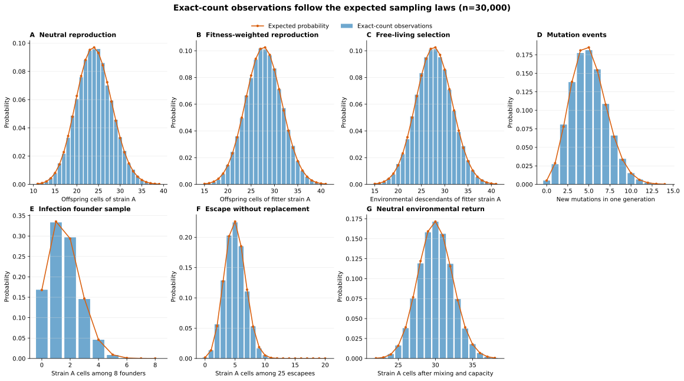
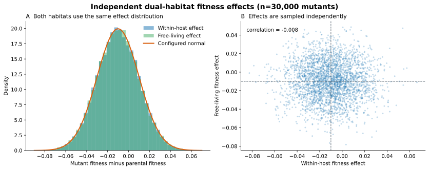
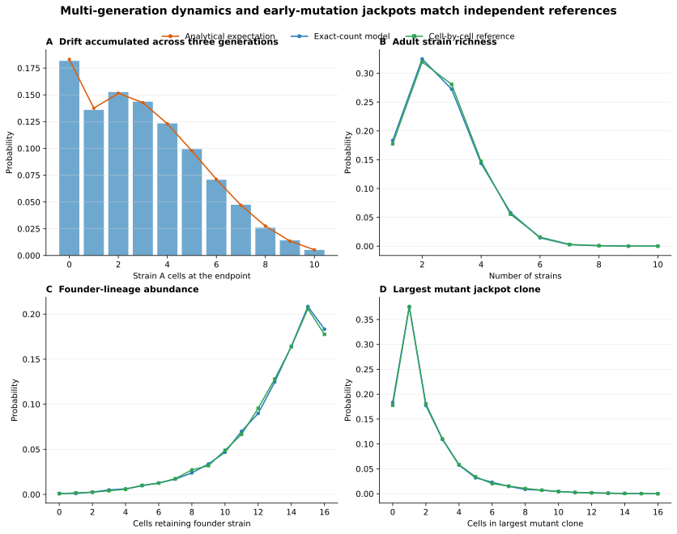

# Distributional validation of the exact-count model

## Plain-language conclusion

The exact-count implementation passed every distributional check used for the
`0.4.0` release candidate. Across repeated simulations, it produced the same
range, shape and relative frequency of outcomes expected from the declared
population-genetic process.

This is stronger than showing that one run is reproducible. A stochastic model
should not produce the same biological outcome every time. Instead, common
outcomes should occur commonly, rare outcomes should occur rarely, and the
amount of variation among replicate populations should be correct.

The validation establishes that the optimized count representation samples the
specified Wright–Fisher, dual-habitat fitness, mutation, infection and escape
processes correctly. It does **not** establish that the biological assumptions
or parameter values are correct for the tubeworm–symbiont system. Those are the
subjects of calibration and the Phase 1 and Phase 2 experiments.



**Figure 1.** Each part of the modeled biological cycle is covered. Infection is
tested as reservoir founder sampling; within-host growth is tested for drift,
selection, mutation and early-mutation jackpots; escape is tested as finite
sampling; and the environment is tested for neutral capacity regulation,
free-living selection and no-return behavior under both profiles.

## How the validation was performed

The analytical checks used 30,000 independent simulated populations. For each
check, the expected probability distribution was calculated before examining
the simulated result. The optimized model was then run repeatedly and its
observed distribution was compared with that expectation.

The more complex mutation-timing check used two independent implementations:

1. the optimized model, which stores counts of strains; and
2. a deliberately slow reference model, which represents all bacterial cells
   individually and chooses the parent and mutation status of every offspring.

Each implementation generated 15,000 complete within-host populations for this
comparison.

Blue bars or lines in the figures are observations from the exact-count model.
Orange lines are distributions calculated analytically. Green lines come from
the independent cell-by-cell implementation. Close overlap is the expected
result if the optimization has preserved the biological stochastic process.



**Figure 2.** Seven one-step comparisons. Panels B and C deliberately give the
same strain opposite fitness ranks in the two habitats. The observed exact-count
distributions closely follow the analytically expected distributions for
within-host and free-living selection, mutation, infection, escape and neutral
environmental return. The purpose is to compare the complete distribution, not
only its average.

## Test 1 — Neutral reproduction and genetic drift

**Biological question.** If two strains have equal fitness, does the model still
produce the random changes in abundance expected from genetic drift?

**Setup.** A parental population contained 30 cells of strain A and 70 of strain
B. Selection and mutation were disabled, and the next generation contained 80
cells.

**Expected result.** Each offspring had a 30% probability of descending from
strain A. Its abundance should therefore follow a binomial distribution with a
mean of 24 cells and variance of 16.8.

**Observed result.** Mean 24.05; variance 16.84. The whole observed distribution
overlapped the expected distribution in Figure 2A.

**Interpretation.** The count optimization preserves neutral Wright–Fisher
drift. It neither suppresses replicate-to-replicate variation nor introduces
additional variation.

## Test 2 — Within-host fitness-weighted reproduction

**Biological question.** When within-host selection is enabled, are parents
sampled according to both their abundance and relative fitness?

**Setup.** Strain A had 30 cells and fitness 2; strain B had 70 cells and a
fitness of 1. The next generation contained 60 cells and mutation was disabled.

**Expected result.** Strain A contributed reproductive weight 60 and strain B
weight 70, giving strain A probability `60 / 130`. Its expected offspring count
was 27.69 with variance 14.91.

**Observed result.** Mean 27.68; variance 14.86 (Figure 2B).

**Interpretation.** The selection switch applies the declared reproductive
weights correctly. This validates the numerical mechanism, not a particular
biological fitness distribution. Phase 1 can keep this selection switch disabled.

## Test 3 — Free-living fitness-weighted reproduction

**Biological question.** Does environmental selection use the strain's
free-living fitness rather than accidentally reusing its within-host fitness?

**Setup.** Strain A had 30 cells, free-living fitness 2 and within-host fitness 1.
Strain B had 70 cells, free-living fitness 1 and within-host fitness 2. The
opposite within-host ranking makes a crossed use of the two traits easy to
detect. One free-living generation produced 60 environmental cells.

**Expected result.** Free-living reproductive weights were 60 for strain A and
70 for strain B. Strain A therefore had expected abundance 27.69 and variance
14.91.

**Observed result.** Mean 27.70; variance 14.92 (Figure 2C).

**Interpretation.** Free-living selection uses only free-living fitness. A strain
can therefore be favored in the environment while being disfavored within hosts,
or vice versa.

## Test 4 — Independent fitness effects in the two habitats

**Biological question.** Do new mutations receive two independent fitness
effects even though both effects come from the same configured distribution?

**Setup.** Thirty thousand offspring were forced to mutate. Both effects were
drawn from a normal distribution with mean −0.01 and standard deviation 0.02.

**Expected result.** The two sets of effects should have the same normal
distribution, but knowing a mutant's within-host effect should provide no
information about its free-living effect. Their correlation should be zero apart
from Monte Carlo noise.



**Figure 3.** Both habitat-specific effects reproduce the configured normal
distribution (panel A), while their scatter has no directional relationship
(panel B). Each point in panel B is one mutant strain.

**Observed result.** Mean effects were −0.01005 within hosts and −0.01016 in the
environment; variances were 0.000401 and 0.000403, respectively. The
cross-habitat correlation was −0.0083, close to zero.

**Interpretation.** The shared distribution does not make the two fitness traits
the same trait. Independent inheritance permits concordant effects, antagonistic
effects and habitat specialists.

## Tests 5 and 6 — Mutation number and parental origin

### Test 5: number of mutation events

**Biological question.** Does every new offspring receive the declared,
independent chance of mutation?

**Setup.** Fifty offspring were produced with mutation probability 0.1. This
deliberately high value makes departures from the expected distribution easy to
detect; it is not a proposed biological mutation rate.

**Expected result.** Five mutation events on average, with variance 4.5.

**Observed result.** Mean 4.997; variance 4.464 (Figure 2D).

### Test 6: parent assigned to each mutation

**Biological question.** Are new mutant strains attached to the parental strain
that actually produced the mutated offspring?

**Setup.** Forty percent of the parental population belonged to strain A. An
offspring therefore had probability `0.4 × 0.1 = 0.04` of being a new mutant
whose parent was strain A.

**Expected result.** Two strain-A-derived mutants on average, with variance 1.92.

**Observed result.** Mean 1.992; variance 1.899.

**Interpretation.** Mutation events occur at the correct rate and are assigned
to parental lineages in the correct proportions. This is necessary for the
strain-lineage table to be meaningful.

## Tests 7 and 9 — Infection from the reservoir

### Test 7: sampling with replacement

**Biological question.** Does the non-depleting effective reservoir give every
founder the environmental strain probabilities, without removing cells needed
by later hosts?

**Setup.** Strain A represented 20% of a two-strain reservoir. Samples contained
25 founders and were taken with replacement.

**Expected result.** Five strain-A founders on average, with variance 4.

**Observed result.** Mean 4.993; variance 4.012.

### Test 9: optimized founder sampler

**Biological question.** Does the fast inverse-CDF sampler used for large strain
tables give the same distribution as ordinary reservoir sampling?

**Setup.** Reservoir frequencies were 20%, 30% and 50%, and each host received
eight founders.

**Expected result for the 20% strain.** Mean 1.6; variance 1.28.

**Observed result.** Mean 1.597; variance 1.277 (Figure 2E).

**Interpretation.** The scalability optimization used during infection does not
change founder probabilities or bottleneck variance.

## Test 8 — Escape sampling at host death

**Biological question.** Is release from a host treated as a finite sample, so a
bacterial cell cannot be released twice from the same adult population?

**Setup.** An adult contained 20 cells of strain A and 80 of strain B. Twenty-five
cells escaped without replacement.

**Expected result.** The hypergeometric distribution predicts five strain-A
escapees on average and variance 3.030. The variance is lower than sampling from
an unlimited reservoir because removing one cell changes what remains.

**Observed result.** Mean 5.000; variance 3.051 (Figure 2F).

**Interpretation.** Escape sampling has the expected finite-population behavior.

## Test 10 — Neutral mixing into the environmental reservoir

**Biological question.** Does capacity regulation preserve a neutral strain's
expected abundance, or can an arbitrary strain identifier receive a systematic
rounding advantage?

**Setup.** A reservoir of 100 cells contained 30% strain A. A neutral return of
100 cells was mixed into it, and the combined pool was apportioned back to 100
effective cells.

**Expected result.** Mean 30 strain-A cells and variance 5.375 after return.

**Observed result.** Mean 29.99; variance 5.423 (Figure 2G).

During validation, the original deterministic tie rule was found to favor lower
strain identifiers whenever fractional remainders were exactly equal. The rule
was corrected so exact ties use a dedicated seeded random draw. This retained
reproducibility while removing the ancestry-label advantage.

An additional integration check ran three host generations with escape set to
zero. Despite infection, within-host growth and mutation, the dormant reservoir
remained exactly identical in all generations because nothing was returned.

**Interpretation.** With free-living selection disabled, environmental
composition changes only through returned bacteria, and exact capacity ties do
not favor old or low-numbered strains. A separate integration test confirms
that, with free-living selection enabled, the reservoir can change even when no
bacteria return—the change is then caused by the declared environmental
selection step.

## Test 11 — Drift accumulated across generations

**Biological question.** Can individually correct one-generation draws still
accumulate incorrectly over several generations?

**Setup.** A population of ten cells started with three strain-A cells. Three
neutral generations were simulated without mutation. The exact endpoint
distribution was also calculated recursively from the Wright–Fisher transition
probabilities.

**Observed result.** The total-variation distance between the two endpoint
distributions was 0.00820 (Figure 4A). A distance of zero would mean identical
distributions and one would mean no overlap; 0.00820 represents less than one
percentage point of probability redistributed across all possible endpoint
counts.

**Interpretation.** Repeated count transitions reproduce the correct accumulated
drift, including loss and fixation of strains.



**Figure 4.** Panel A compares three accumulated Wright–Fisher generations with
the exact analytical endpoint distribution. Panels B–D compare the optimized
count model with an independent cell-by-cell model during population expansion
and mutation. The lines are almost superimposed.

## Test 12 — Mutation timing and jackpot clones

**Biological question.** Does the optimized model preserve the important fact
that an early mutation can leave many descendants, whereas a late mutation is
usually represented by only one or a few cells?

**Setup.** Two founder cells expanded through population sizes 4, 8 and 16,
followed by two additional generations at 16 cells. Mutation probability was
0.04. The same process was independently simulated with explicit cell objects.

Three endpoint features were compared:

- total adult strain richness;
- the number of cells still belonging to the original founder strain; and
- the size of the largest mutation-derived clone.

**Observed result.** The mean differences between the count and cell models were
0.001 strains for richness, −0.0003 cells for founder abundance and 0.0025 cells
for the largest mutant clone. The total-variation distance between the richness
distributions was 0.00647 (Figure 4B–D).

**Interpretation.** The count model does not merely generate the right total
number of mutations. It also reproduces the clone-size consequences of when
those mutations occurred, including uncommon early-mutation jackpots.

## Acceptance criteria

The release criteria were declared in the validation program rather than chosen
after seeing the results:

- analytical means and variances had to fall within six Monte Carlo standard
  errors of their expected values;
- the multi-generation distribution had to have total-variation distance below
  its declared limit of 0.015; and
- the cell-reference richness distribution had to remain below its declared
  limit of 0.03, with feature means within six standard errors.

All checks passed. The widest standardized discrepancy was 2.12 standard errors,
well inside the six-standard-error release boundary. The conservative boundary
is intended to detect meaningful implementation errors without causing the
release test to fail because a valid random sample happened to be unusual.

The complete numerical results are in
[distributional-validation-results.md](distributional-validation-results.md),
and the machine-readable record is in
[distributional-validation.json](distributional-validation.json).

## What this report does and does not validate

### Validated

- neutral genetic drift at count resolution;
- within-host and free-living fitness-weighted reproduction;
- independence of the two mutant fitness-effect draws;
- per-offspring mutation and mutation parentage;
- non-depleting environmental founder sampling;
- finite escape sampling;
- the optimized infection sampler;
- label-neutral Hamilton capacity regulation;
- accumulation of drift across generations;
- mutation-timing and jackpot-clone distributions; and
- invariance of the dormant Phase 1 reservoir when no bacteria return; and
- environmental change under free-living selection even when no bacteria return.

### Not yet validated biologically

- empirical values of mutation rate, bottleneck size, host abundance, escape
  rate or reservoir capacity;
- whether Hamilton capacity regulation is the best biological representation of
  the effective reservoir;
- the existence or location of a long-run environmental diversity equilibrium;
- finite genomic sites, recurrent mutation, recombination or horizontal gene
  transfer;
- the biological distribution and possible correlation of fitness effects
  across habitats;
- the number and timing of free-living bacterial generations represented by one
  host-population generation; and
- biological predictions involving either selection process.

These unresolved items are not software defects. They define the calibration,
sensitivity analysis and scientific experiments that follow this release.

## Reproducing the report

```bash
python -m pip install -e '.[dev,plot]'
python scripts/validate_distributions.py --repetitions 30000 \
  --seed 20260810 \
  --json docs/distributional-validation.json \
  --markdown docs/distributional-validation-results.md
python scripts/plot_distributional_validation.py --repetitions 30000 \
  --seed 20260810 \
  --output docs/figures
```

The figures are generated from fresh simulations rather than drawn from summary
statistics. The seed makes the report reproducible without asserting that every
valid implementation must generate the same individual random trajectory.
