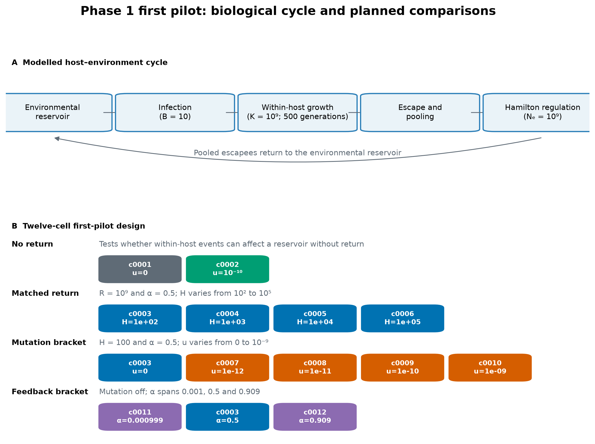
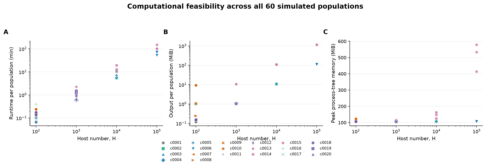
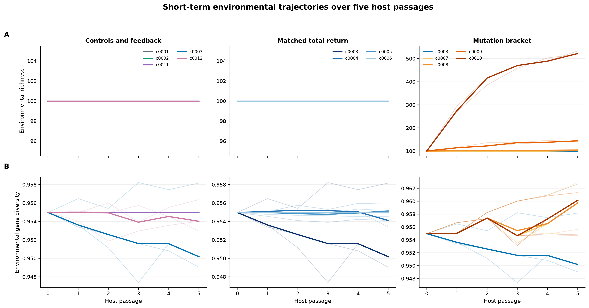
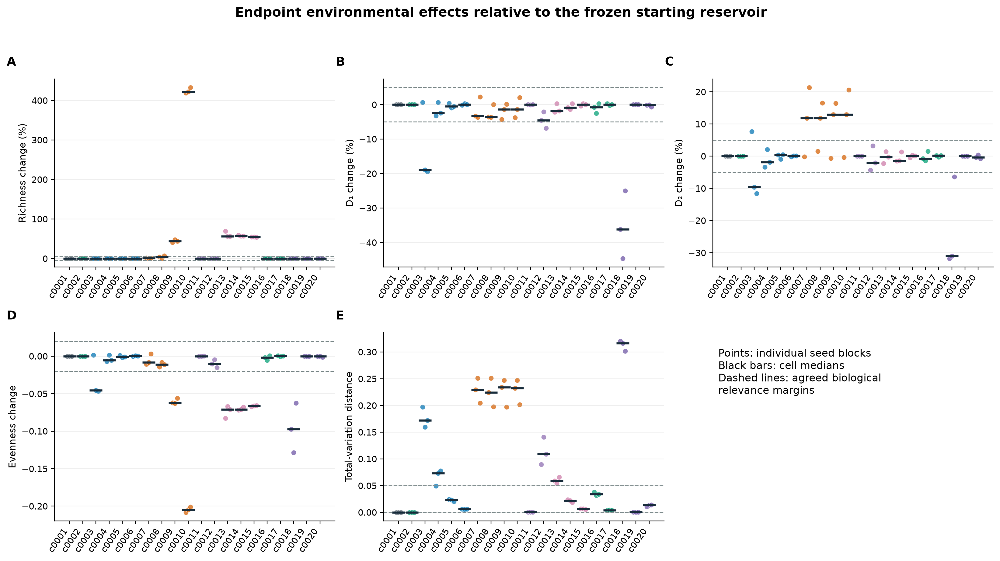
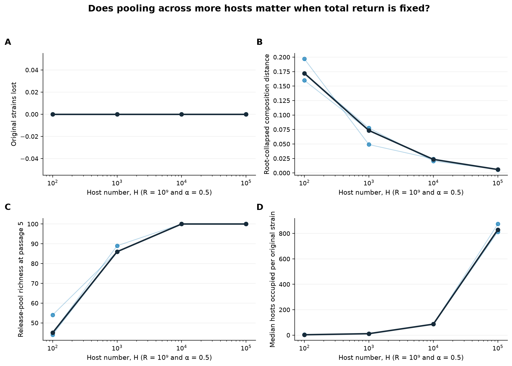
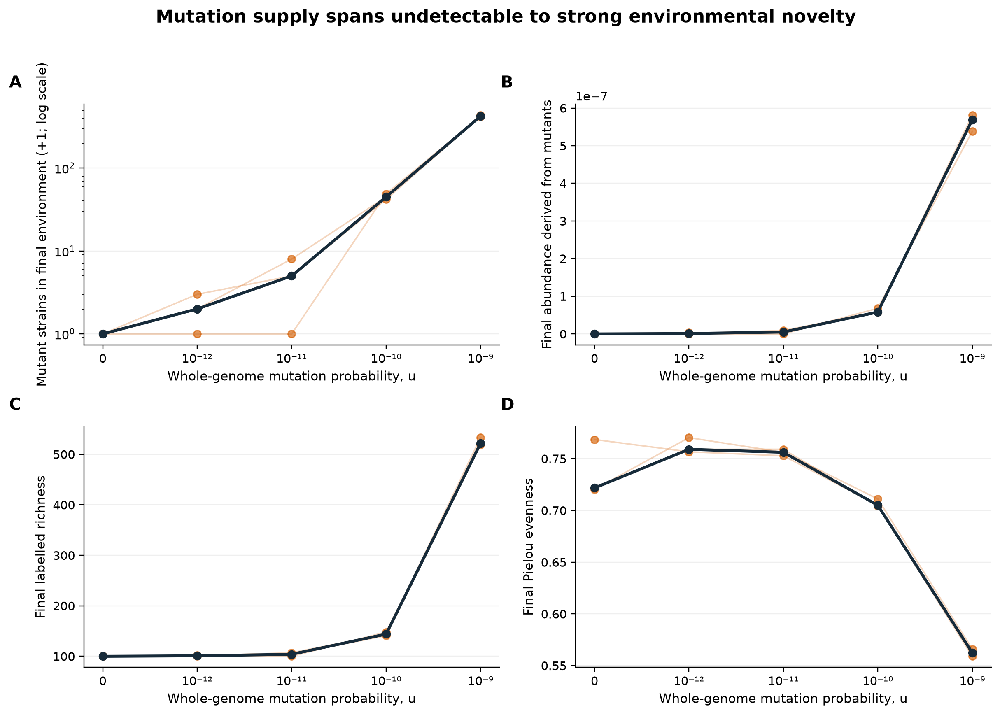
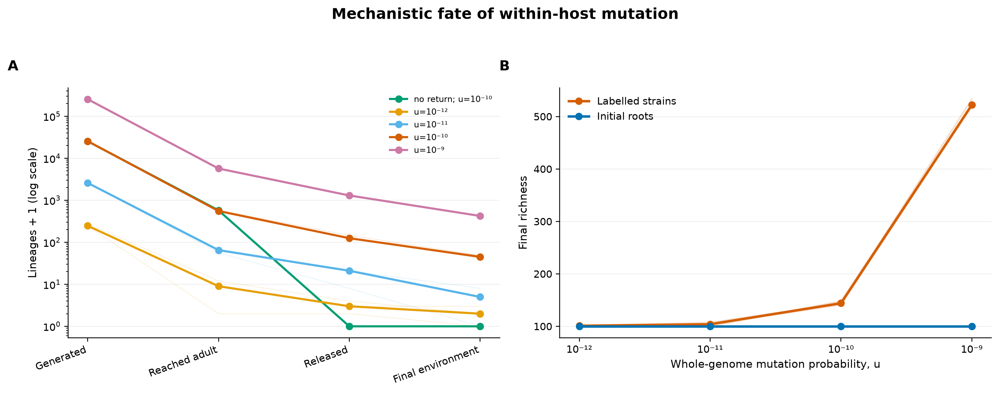

# Phase 1 first-pilot report: neutral host feedback and environmental symbiont diversity

**Status:** Draft for scientific review and editing  
**Analysis date:** 12 August 2026  
**Experiment:** `phase1-first-pilot-core12`  
**Scope:** exploratory feasibility, mechanism and calibration pilot; not a confirmatory experiment  
**Completed simulations:** 12 parameter cells × 3 independent seed blocks = 36 populations  
**Simulated duration:** 5 host passages per population

## Executive summary

The first pilot ran successfully on the Mac and produced an internally consistent
set of 36 endpoint populations. All final environmental populations contained
exactly `10^9` cells, all checksums matched, the two no-return controls left the
environment exactly unchanged, and all required diagnostic outputs were
present. The pilot therefore supports proceeding to the next calibration stage,
subject to the decisions listed at the end of this report.

The main biological result is that **the number of hosts matters even when the
total number of bacteria returned is fixed**. When `10^9` cells were returned
after each passage, a return pooled from 100 hosts produced a median
root-collapsed composition distance of 0.172 from the starting reservoir after
five passages. The corresponding distances were 0.073, 0.023 and 0.0059 when
the same return was pooled from 1,000, 10,000 and 100,000 hosts. Pooling over
more independent infections therefore averaged away much of the
host-sampling noise.

Host passage without mutation did not remove any of the 100 original strains
from the environment over five passages. Its short-term effect was instead a
redistribution of abundance among existing strains. This redistribution was
strongest when the return was assembled from few hosts. At 100 hosts, the
median effective common-strain diversity, `D1`, was 18.9% below its starting
value, although the three populations were variable and one did not show a
decrease. The pilot is too small for a confirmatory diversity-reduction claim.

Within-host mutation generated many new strain labels, but almost all remained
extremely rare in the final environment. At mutation probability `u = 10^-10`,
the median pathway was 25,456 generated mutant lineages → 554 observed in adult
hosts → 124 released → 44 present in the final environment. Those final mutants
accounted for only `5.8 × 10^-8` of environmental abundance. At `u = 10^-9`, the
corresponding values were 253,663 → 5,689 → 1,298 → 422, but mutants still
accounted for only `5.7 × 10^-7` of abundance.

Consequently, high mutation increased **labelled richness** while reducing
Pielou evenness, without materially increasing the effective number of common
strains. Collapsing every mutant back into its original ancestor changed `D1`
by less than 0.001 in every mutation treatment. Mutation therefore created many
new labels in this five-passage pilot, but not abundant new ecological types.

The computation was feasible on the Mac. The 36 populations used 3.68 hours of
summed wall time when run sequentially, produced 409.8 MiB of uncompressed
diagnostic output and had a maximum measured process-tree memory use of
123.5 MiB. Runtime, rather than memory, will limit long runs with 100,000 hosts.

## What this pilot can and cannot answer

| Phase 1 question | First-pilot answer |
|---|---|
| Does return from hosts change the environment? | **Yes, over five passages in the small-host treatments.** No-return controls were exactly unchanged, whereas the 100-host, mutation-free treatment had composition distances of 0.160–0.197. |
| Does passage remove, create or redistribute diversity? | **Primarily redistribution over this short interval when mutation was off.** No original strain was lost. Mutation created many labels, but they remained too rare to change common-strain diversity appreciably. |
| Which parameter combinations produce different outcomes? | **Preliminary boundaries were located.** Few-host return produced redistribution and a possible diversity reduction; `u = 10^-10` and `10^-9` produced increased richness with reduced evenness; weak feedback and the largest-host matched-return cells were negligible over five passages. |
| Does diversity reach equilibrium? | **Not tested.** Five passages are far too short, especially at weak feedback. |
| Which parameters and interactions explain most variation? | **Not yet estimable.** The pilot suggests host number at fixed return and mutation supply are important, but it was not a response-surface experiment. |
| Do host number and escape act independently or only through total return? | **Only partly answered.** The fixed-return comparison shows that total return alone is insufficient. Independent main effects require at least one additional return level and the later parameter map. |
| Does pooling across many hosts differ from a larger contribution by fewer hosts? | **Yes, provisionally.** More hosts represented more strains in the pooled release and produced much less environmental compositional displacement at the same total return. |

## 1. Biological and model context

One host passage consisted of five steps:

1. each host acquired 10 bacterial founders from the environmental reservoir;
2. these bacteria grew neutrally to a within-host carrying capacity of `10^9`;
3. the adult population remained at carrying capacity for 500 bacterial
   generations;
4. a specified fraction escaped from each host and all escapees were pooled;
5. the pooled return was mixed with the unchanged environmental reservoir and
   regulated back to an environmental capacity of `10^9` cells.

Infection did not deplete the environmental reservoir. There was no free-living
generation, mutation or selection. Within-host selection was disabled, all
starting fitness values were one, and mutation fitness effects were neutral.
Every mutation created a new strain label under the model's infinite-alleles
representation.

**Figure 1. Biological cycle and first-pilot comparisons.** `B` is the number
of infection founders per host. `K` is the adult within-host carrying capacity.
`H` is the number of hosts. `u` is the whole-genome probability that one
bacterial offspring becomes a new strain in one within-host bacterial
generation. `R` is the total number of bacterial cells returned by all hosts.
The feedback fraction, `alpha`, is the host-derived fraction of the mixture
before environmental capacity regulation.

The frozen environmental population began with 100 strains in a Fisher
log-series abundance distribution. Its initial values were:

| Response | Starting value | Biological interpretation |
|---|---:|---|
| Richness, `D0` | 100 | Number of strain labels present |
| Effective common-strain diversity, `D1` | 34.228 | Effective number of commonly represented strains |
| Effective dominant-strain diversity, `D2` | 22.206 | Effective number after giving more weight to abundant strains |
| Pielou evenness | 0.7672 | Equality of abundance across the 100 labels |
| Gene diversity | 0.9550 | Probability that two sampled cells carry different labels |

Full definitions and the rationale for the model are in the
[Phase 1 experimental design](phase1-experimental-design.md).

## 2. Experimental design

### 2.1 Shared settings

Every cell used:

- infection bottleneck `B = 10` cells per host;
- within-host carrying capacity `K = 10^9` cells per adult host;
- growth factor 1.2;
- 500 steady bacterial generations at carrying capacity;
- environmental capacity ratio `c = 1`, giving `N_E = 10^9`;
- five host passages;
- the same frozen 100-strain starting abundance vector; and
- three independently seeded population replicates.

### 2.2 The 12 cells

An experimental **cell** is one defined combination of parameter values. The
cells were arranged to make four biologically interpretable comparisons rather
than to form a large factorial experiment.

| Cell | Purpose | Hosts `H` | Escape fraction `f` | Total return `R` | Feedback `alpha` | Mutation `u` |
|---|---|---:|---:|---:|---:|---:|
| c0001 | No-return reference | 100 | 0 | 0 | 0 | 0 |
| c0002 | No-return mutation-gating control | 100 | 0 | 0 | 0 | `10^-10` |
| c0003 | Matched return; few hosts | 100 | `10^-2` | `10^9` | 0.5 | 0 |
| c0004 | Matched return | 1,000 | `10^-3` | `10^9` | 0.5 | 0 |
| c0005 | Matched return | 10,000 | `10^-4` | `10^9` | 0.5 | 0 |
| c0006 | Matched return; many hosts | 100,000 | `10^-5` | `10^9` | 0.5 | 0 |
| c0007 | Mutation bracket | 100 | `10^-2` | `10^9` | 0.5 | `10^-12` |
| c0008 | Mutation bracket | 100 | `10^-2` | `10^9` | 0.5 | `10^-11` |
| c0009 | Mutation bracket | 100 | `10^-2` | `10^9` | 0.5 | `10^-10` |
| c0010 | Mutation stress/calibration level | 100 | `10^-2` | `10^9` | 0.5 | `10^-9` |
| c0011 | Very weak feedback | 100 | `10^-5` | `10^6` | 0.000999 | 0 |
| c0012 | Strong feedback | 1,000 | `10^-2` | `10^10` | 0.9091 | 0 |

The exact machine-readable matrix is available in
[phase1-first-pilot-cells.tsv](../experiments/work/trophosome/p01-neutral-feedback/design/phase1-first-pilot-cells.tsv).

### 2.3 Replicates and seed blocks

The three independent population replicates used master seeds 666, 667 and 668,
recorded as seed blocks `sb0001`, `sb0002` and `sb0003`. The same master seed was
used at the same seed-block position across cells. This creates a reproducible
blocking structure, but parameter changes can alter the number and order of
random events. The seed blocks must therefore not be interpreted as identical
realized histories after the simulations diverge.

One complete simulated population is the independent unit for environmental
inference. Hosts within a population share the same environmental history and
are not independent population replicates.

## 3. Analysis approach

### 3.1 Endpoint comparisons

The full labelled environmental composition was retained at passage 5. Earlier
passages retained environmental richness and gene diversity in the generation
summary. Endpoint counts were compared with the exact frozen starting state.
This is also the exact no-return reference because Hamilton regulation makes no
change when `R = 0`.

The primary endpoint responses were `D0`, `D1`, `D2`, Pielou evenness and total
variation distance. Total variation is the fraction of environmental abundance
that would need to be reassigned among strain labels to reproduce the starting
composition.

### 3.2 Mechanistic decomposition

The analysis followed new mutant labels through four filters:

1. generated during within-host reproduction;
2. present in an adult host;
3. sampled among released bacteria; and
4. retained in the final regulated environment.

Every final mutant was also traced through its recorded parents to one of the
100 starting strains. Diversity was recalculated after merging mutant
descendants with that original root. This **root-collapsed** view separates new
labels created by mutation from redistribution among the original ancestries.

For the matched-return comparison, the analysis measured infection coverage,
release-pool richness and the number of hosts occupied by each original strain.
These variables explain why returns of equal size can have different
compositions.

### 3.3 Statistical interpretation

The pilot had only three independent populations per cell. Results are
therefore presented as medians and full three-replicate ranges. No p-values,
formal equivalence tests or confirmatory confidence intervals are reported.

The predeclared biological relevance margins were used only as screening guides:

- 5% for `D0`, `D1` and `D2`;
- 0.02 absolute units for evenness; and
- 0.05 for composition distance.

Formal outcome classifications require simultaneous intervals from more
replicates. In this report, terms such as “signal”, “boundary” and “point
estimate” deliberately indicate exploratory evidence.

The calculations and figures can be regenerated with
[analyse_first_pilot.py](../experiments/work/trophosome/p01-neutral-feedback/analysis/analyse_first_pilot.py).
Its derived population-level and cell-level tables are in
[s01-pilot-derived](../experiments/work/trophosome/p01-neutral-feedback/analysis/s01-pilot-derived/).

## 4. Quality control and computational feasibility

### 4.1 Simulation integrity

All 36 populations passed the endpoint audit:

- each run had a committed completion record;
- every final-state SHA-256 checksum matched its completion record;
- every final environmental state contained exactly `10^9` cells;
- all 100 starting strains had neutral within-host and environmental fitness;
- the no-return environmental compositions were exactly unchanged after five
  passages;
- lineage parentage could be traced for every mutant present at the endpoint;
- all 36 populations had five generation summaries; and
- no checkpoint files remained after successful completion.

The largest number of new mutants realized in any one within-host bacterial
transition was 8. The configured materialization limit was 100,000, so the
maximum was 0.008% of the limit and far below the predeclared 25% gate.

### 4.2 Resource use

**Figure 2. Runtime, diagnostic output and peak process-tree memory for each of
the 36 populations.** Runtime and output increased strongly with host number.
Memory remained close to 105–123 MiB for all cells, except that the high-mutation
cell approached the top of this narrow range because it retained many lineage
records.

| Seed block | Populations | Summed runtime | Output | Peak memory |
|---|---:|---:|---:|---:|
| sb0001 | 12 | 60.3 min | 136.57 MiB | 122.84 MiB |
| sb0002 | 12 | 77.8 min | 136.58 MiB | 123.01 MiB |
| sb0003 | 12 | 82.5 min | 136.62 MiB | 123.46 MiB |
| **Total or maximum** | **36** | **220.7 min** | **409.78 MiB** | **123.46 MiB** |

These runtimes are sums across independently runnable populations, not the time
required if different populations run in parallel. Later runs in this pilot
wrote to synchronized OneDrive scratch and were slower. This is consistent with
an I/O penalty but does not by itself prove its size. Scratch has since been
moved to the local Desktop for Mac execution.

The median runtime for a five-passage, mutation-free population increased from
0.10 minutes at 100 hosts to 0.62 minutes at 1,000 hosts, 5.57 minutes at 10,000
hosts and 69.99 minutes at 100,000 hosts. Peak memory barely changed. Long runs
at 100,000 hosts should therefore be sent to the HPC and benchmarked there
before launching all seed blocks.

The default one-hour checkpoint interval was exercised: a checkpoint was
written during the slow 100,000-host run and removed after successful
completion. That population did not need to resume. Interrupted restart and
output truncation are covered by the maintained checkpoint tests and release
checklist; a deliberate end-to-end interrupt/resume smoke test on the HPC is
still advisable before multi-day runs.

## 5. Biological results

### 5.1 No-return controls behaved exactly as required

Cells c0001 and c0002 ended with exactly the starting environmental
composition: 100 strains, `D1 = 34.228`, `D2 = 22.206`, evenness 0.7672 and
composition distance zero in all six populations.

Mutation was active inside the hosts in c0002. A median 25,319 mutant lineages
were generated and 574 were present in adult-host output, but none were
released because escape was zero and none reached the environment. This is a
clean mechanistic demonstration that within-host mutation cannot affect the
Phase 1 effective reservoir without host-derived return.

### 5.2 Mutation-free passage redistributed existing abundance

All mutation-free return treatments retained all 100 original strains after
five passages. Richness therefore did not reveal their effect. Composition and
effective diversity did.

**Figure 3. Environmental richness and gene-diversity trajectories over the
five host passages.** Thick lines show cell medians and faint lines show the
three population replicates. The full labelled composition was archived only
at passage 5, so composition distance and Hill diversities are endpoint
responses rather than complete trajectories.

**Figure 4. Endpoint changes from the frozen starting reservoir.** Each coloured
point is one independent population; black bars are cell medians. Dashed lines
show the agreed biological relevance margins. They are screening guides here,
not formal classification intervals.

The clearest mutation-free change occurred in c0003, where `R = 10^9` was
assembled from only 100 hosts. Its median composition distance was 0.172
(range 0.160–0.197). Median `D1` was 18.9% below the starting value and median
`D2` was 9.6% below it. However, one of the three populations had `D1` 0.65%
above and `D2` 7.64% above the start. The correct pilot conclusion is therefore
**a strong redistribution signal with an uncertain diversity-reduction
classification**, not a confirmed reduction.

The strong-feedback c0012 treatment also redistributed existing abundance:
median composition distance was 0.109 (range 0.089–0.141). Its median `D1`
change was -4.55%, close to the 5% relevance boundary, whereas `D2` ranged from
-4.28% to +3.21%. This cell is another useful precision-pilot boundary.

Very weak feedback in c0011 was numerically visible but biologically negligible
over five passages. Its median composition distance was 0.00041 and all scalar
diversity changes were far inside their margins. This is a finite-time result,
not evidence that weak feedback has no long-run effect.

### 5.3 Pooling across more hosts reduced sampling distortion at fixed return

**Figure 5. Effect of host number when total return and feedback strength were
fixed.** All four cells returned exactly `10^9` bacteria and had `alpha = 0.5`.
Faint lines connect populations in the same seed block; the dark line connects
cell medians.

| Hosts | Median release richness at passage 5 | Median hosts occupied per original strain | Median composition distance | Median `D1` change |
|---:|---:|---:|---:|---:|
| 100 | 45 | 3.0 | 0.172 | -18.9% |
| 1,000 | 86 | 11.5 | 0.073 | -2.43% |
| 10,000 | 100 | 86.5 | 0.023 | -0.45% |
| 100,000 | 100 | 829.5 | 0.0059 | +0.03% |

The small infection bottleneck meant that individual hosts carried only a
small sample of the reservoir. With 100 hosts, the passage-5 release represented
a median of only 45 of the 100 original strains. With 10,000 or 100,000 hosts,
all 100 strains were represented in every release. Pooling across many hosts
therefore made the returned composition much closer to the environmental
composition, even though the total number of returned cells was identical.

This is early evidence that host abundance and per-host escape do not act only
through their product, total return. At fixed `R`, changing `H` also changes the
number of independent infection samples, `H × B`. The additional `R = 10^8`
matched-return pair remains necessary to test whether this pooling pattern
persists at another feedback strength.

### 5.4 Mutation created many labels but little abundant novelty

**Figure 6. Environmental novelty across the mutation bracket.** Faint lines
connect seed-block populations and dark points are cell medians. Panel A is
shown as count plus one on a logarithmic axis so that zero and small counts can
be displayed together.

| Mutation `u` | Generated lineages | In adults | Released | Final mutant labels | Final mutant abundance | Final richness |
|---:|---:|---:|---:|---:|---:|---:|
| `10^-12` | 246 | 8 | 2 | 1 | `1.0 × 10^-9` | 101 |
| `10^-11` | 2,585 | 64 | 20 | 4 | `5.0 × 10^-9` | 104 |
| `10^-10` | 25,456 | 554 | 124 | 44 | `5.8 × 10^-8` | 144 |
| `10^-9` | 253,663 | 5,689 | 1,298 | 422 | `5.7 × 10^-7` | 522 |

Values are medians across the three populations. The positive mutation levels
successfully bracketed environmental novelty from zero or a few final mutants
to hundreds of final labels. `u = 10^-10` is the most useful primary level for
the next comparison because it produces a clear but non-overwhelming response.
`u = 10^-11` is useful as a lower boundary, and `u = 10^-9` should remain a
calibration or stress condition rather than the only biological mutation level.

At `u = 10^-10`, richness increased by a median 44% and evenness fell by 0.062.
At `u = 10^-9`, richness increased by 422% and evenness fell by 0.205. These
meet the point-estimate rule for **richness increased but evenness reduced**.
Despite this, median `D1` changed by only -1.38% at both levels because the new
labels were extremely rare.

Median `D2` was about 13% above the starting value in the `u = 10^-10` and
`10^-9` cells, but the increase was already present at lower mutation levels and
was not caused by mutant abundance. Root-collapsed `D2` gave the same result.
The most defensible interpretation is stochastic redistribution among the
original roots, not a mutation-driven increase in dominant-strain diversity.

**Figure 7. Mechanistic fate of within-host mutants.** Panel A shows attrition
from generation to the final environment. Panel B compares the number of strain
labels with the number of original ancestral roots. All 100 roots remained
present even as mutation added hundreds of rare labels.

### 5.5 Provisional biological classification

The following classifications apply only to the five-passage point estimates.
They are not confirmatory calls because simultaneous intervals cannot be
estimated reliably from three populations.

| Cell(s) | Provisional short-term outcome | Reason |
|---|---|---|
| c0001–c0002 | Exact negligible environmental effect | No host-derived return; composition remained exactly unchanged |
| c0003 | Mixed/uncertain, with reduction and redistribution signal | Median `D1` and `D2` below -5%, but one population crossed to an increase; composition distance always large |
| c0004 | Redistribution boundary | Median composition distance 0.073; common and dominant diversity changes small |
| c0005–c0006 | Negligible by point estimates | All primary median changes and composition distance within margins |
| c0007 | Low novelty plus redistribution | Median richness +1%; one final mutant; composition changed among original roots |
| c0008 | Mutation boundary, mixed/uncertain | Median richness +4%, range 0–7%; evenness change still within 0.02 |
| c0009–c0010 | Richness increased but evenness reduced | Median richness +44% and +422%; evenness -0.062 and -0.205; mutants remained rare |
| c0011 | Negligible over five passages | Feedback fraction about 0.001; composition distance 0.00041 |
| c0012 | Redistribution with uncertain diversity effect | Composition distance 0.109; `D1` close to reduction margin and `D2` mixed |

## 6. Assessment against the predeclared expansion gates

| Gate | Result | Assessment |
|---|---|---|
| Population and lineage invariants pass | All audited endpoints had correct capacity, checksums and traceable lineage parents | Pass |
| No-return environment unchanged | Exact equality in all six no-return populations | Pass |
| Required outputs present and internally usable | All 36 populations supplied the retained endpoint, host, pool, release, lineage, summary and metadata outputs used here | Pass |
| Mutation materialization below 25% of limit | Maximum 8 of 100,000, or 0.008% | Pass |
| Next-stage runtime and storage below 70% of budget | First pilot used 3.68 h and 0.41 GiB, but long-run c0006 requires an HPC benchmark | Conditional pass for the five-passage extension; pending for Stage 2 |
| Mutation bracket informative | Final mutant richness ranged from 0–2 at `10^-12` to 419–433 at `10^-9` | Pass |
| Matched-return cells have identical `R` and `alpha` | All four had exact integer `R = 10^9` and `alpha = 0.5` | Pass |

The technical criteria support expansion. The scientific recommendation is to
use `u = 10^-10` as the principal mutation-enabled level, keep `u = 10^-11` as
a lower boundary and retain `u = 10^-9` only as a stress/calibration level.

## 7. Recommendations for the next stage

### 7.1 Complete the short pilot extension before freezing Stage 2

The five pre-specified extension cells remain useful:

1. three mutation-enabled matched-return cells at 1,000, 10,000 and 100,000
   hosts, using `u = 10^-10`; and
2. the mutation-free 100-host and 10,000-host pair at `R = 10^8`.

The first group tests whether the pooling effect changes the transmission of
new mutants. The second supplies another return level so that host-number and
total-return effects are not inferred from a single fixed return. These cells
should run on the HPC because the 100,000-host cell dominates runtime and the
mutation lineage table may be much larger than in c0010.

### 7.2 Proposed equilibrium/precision sentinels

The following cells cover the distinct behaviors located by this pilot:

| Sentinel | Reason to retain |
|---|---|
| c0001 | Exact no-return reference and software-regression control |
| c0003 | Few-host, high-sampling-noise return with a possible diversity reduction |
| c0006 | Many-host extreme at the same total return; expected near-equivalence boundary |
| c0009 | Informative mutation-enabled baseline at `u = 10^-10` |
| c0011 | Very weak feedback and the key finite-time versus equilibrium case |
| c0012 | Strong-feedback redistribution boundary |

Cell c0004 is a useful optional seventh sentinel because its composition
distance lies close to the agreed threshold and its variability is important
for precision estimation.

Begin Stage 2 with 12 new independent seed blocks, as planned. Use whole
population replicates for uncertainty. Do not use individual hosts or passages
as independent observations. Final confirmatory replicate counts should be
estimated from Stage 2 and should not be based on the unstable standard
deviations from only three pilot populations.

For `alpha = 0.5` or 0.909, the existing horizon rule starts at 250 passages.
For c0011, the rule reaches the 5,000-passage cap before accumulating the target
20 feedback-exposure units. A non-converged weak-feedback result must be
reported as such rather than called equilibrium.

### 7.3 HPC launch safeguards

Before launching all Stage 2 populations:

1. benchmark 25 passages of c0006 on one HPC core using the local scratch
   filesystem;
2. project the 250-passage wall time and require a comfortable margin below the
   48-hour per-run limit;
3. deliberately interrupt and resume one checkpointed test population and
   verify it against an uninterrupted run;
4. verify the output compaction step on a copied test run; and
5. only then submit independent cells and seed blocks across the available CPUs.

The model itself should remain single-process within one population for this
stage. Portability and parallelism are best handled by the wrapper: each
cell–seed-block population is independent, receives one CPU by default and
writes to its own run directory. This is the safest use of the HPC's more than
100 CPUs without introducing architecture-dependent changes into the biological
model.

## 8. Scientific decisions still required before long runs

1. **Weak-feedback estimand.** Decide whether the primary c0011 result is change
   over a fixed biologically meaningful interval, statistical equilibrium, or
   both as separately labelled outcomes. Equilibrium cannot be assumed at the
   5,000-passage cap.
2. **No-return replication in Stage 2.** Because its environmental state is
   deterministic under Phase 1 assumptions, decide whether c0001 needs all 12
   long replicates or one full-horizon software-regression run plus short checks
   for every seed block.
3. **Pilot extension timing.** Decide whether the five pre-specified extension
   cells are completed before the Stage 2 sentinel freeze or incorporated into
   the first HPC batch.
4. **Mutation levels.** Approve `u = 10^-10` as the primary informative level,
   `10^-11` as a lower boundary and `10^-9` as a labelled stress sensitivity.
5. **Permanent archival rule for this diagnostic pilot.** The 409.8 MiB is
   pre-compaction diagnostic output. Retain it while this report is being
   reviewed. After the mechanistic tables are frozen and checksummed, apply the
   agreed policy: preserve the final environmental state, provenance,
   completion/checksum records and compact derived results; remove bulky
   per-host diagnostic files unless this first pilot is explicitly designated
   an archival mechanistic dataset.

## 9. Reproducibility record

| Item | Frozen value or location |
|---|---|
| Software version | 0.6.0 |
| Model specification | 2.0.0 |
| Output schema | 2.2.0 |
| Source commit used for all runs | `7c988b4601dcd19f609667a179b75a3c7c1dd90d` |
| Source SHA-256 | `b752885bfd23ae2dcf4f44b22657c3435e2fcd4d676f484ff3689614eaf82cad` |
| Python / NumPy | Python 3.14.6 / NumPy 2.5.2 |
| Platform | macOS 15.7.7, Intel x86_64 |
| Seed blocks | sb0001 = 666; sb0002 = 667; sb0003 = 668 |
| Run manifest | [phase1-first-pilot-runs.tsv](../experiments/work/trophosome/p01-neutral-feedback/manifests/phase1-first-pilot-runs.tsv) |
| Analysis summary | [analysis-summary.json](../experiments/work/trophosome/p01-neutral-feedback/analysis/s01-pilot-derived/analysis-summary.json) |
| Population endpoints | [run-endpoints.tsv](../experiments/work/trophosome/p01-neutral-feedback/analysis/s01-pilot-derived/run-endpoints.tsv) |
| Cell summaries | [cell-summaries.tsv](../experiments/work/trophosome/p01-neutral-feedback/analysis/s01-pilot-derived/cell-summaries.tsv) |
| Short trajectories | [environment-trajectories.tsv](../experiments/work/trophosome/p01-neutral-feedback/analysis/s01-pilot-derived/environment-trajectories.tsv) |

## Appendix A. Endpoint medians and ranges

Values below are median `[minimum, maximum]` across the three independent
population replicates.

| Cell | `D0` change | `D1` change | `D2` change | Evenness change | Composition distance |
|---|---:|---:|---:|---:|---:|
| c0001 | 0% [0, 0] | 0% [0, 0] | 0% [0, 0] | 0 [0, 0] | 0 [0, 0] |
| c0002 | 0% [0, 0] | 0% [0, 0] | 0% [0, 0] | 0 [0, 0] | 0 [0, 0] |
| c0003 | 0% [0, 0] | -18.89% [-19.42, 0.65] | -9.61% [-11.64, 7.64] | -0.045 [-0.047, 0.001] | 0.172 [0.160, 0.197] |
| c0004 | 0% [0, 0] | -2.43% [-3.21, 0.61] | -1.88% [-3.34, 2.07] | -0.005 [-0.007, 0.001] | 0.073 [0.049, 0.078] |
| c0005 | 0% [0, 0] | -0.45% [-0.91, 0.43] | 0.37% [-0.92, 0.48] | -0.001 [-0.002, 0.001] | 0.023 [0.021, 0.024] |
| c0006 | 0% [0, 0] | 0.03% [-0.14, 0.28] | 0.08% [-0.16, 0.13] | 0.0001 [-0.0003, 0.0006] | 0.0059 [0.0057, 0.0060] |
| c0007 | 1% [0, 2] | -3.29% [-3.66, 2.27] | 11.85% [-0.16, 21.39] | -0.008 [-0.011, 0.003] | 0.229 [0.204, 0.251] |
| c0008 | 4% [0, 7] | -3.59% [-3.66, 0.05] | 11.85% [1.50, 16.53] | -0.011 [-0.014, -0.008] | 0.224 [0.198, 0.251] |
| c0009 | 44% [41, 48] | -1.38% [-4.31, 0.11] | 12.99% [-0.64, 16.46] | -0.062 [-0.063, -0.056] | 0.234 [0.197, 0.247] |
| c0010 | 422% [419, 433] | -1.38% [-3.75, 2.11] | 12.99% [-0.40, 20.61] | -0.205 [-0.208, -0.201] | 0.232 [0.201, 0.247] |
| c0011 | 0% [0, 0] | 0.004% [-0.012, 0.022] | 0.004% [0.002, 0.027] | 0.00001 [-0.00003, 0.00005] | 0.00041 [0.00035, 0.00042] |
| c0012 | 0% [0, 0] | -4.55% [-6.81, -2.11] | -2.07% [-4.28, 3.21] | -0.010 [-0.015, -0.005] | 0.109 [0.089, 0.141] |

## Appendix B. Interpretation cautions

- Environmental richness remained 100 in all mutation-free return treatments,
  but this does not mean passage had no effect. Large abundance redistribution
  occurred while every original label remained above one cell.
- Pielou evenness is sensitive to the number of labels in its denominator.
  Hundreds of extremely rare mutants can lower evenness without changing the
  abundance distribution of common ancestral types.
- Seed-block lines in figures help visualize reproducible blocks but are not
  exact counterfactual pairings after parameter-dependent random streams
  diverge.
- The no-return environmental reference is deterministic under the Phase 1
  assumptions. Later selection, free-living reproduction or a finite depleting
  reservoir would change that property.
- Five passages measure early response, not statistical equilibrium,
  convergence time, fixation time or continuing equilibrium fluctuations.
