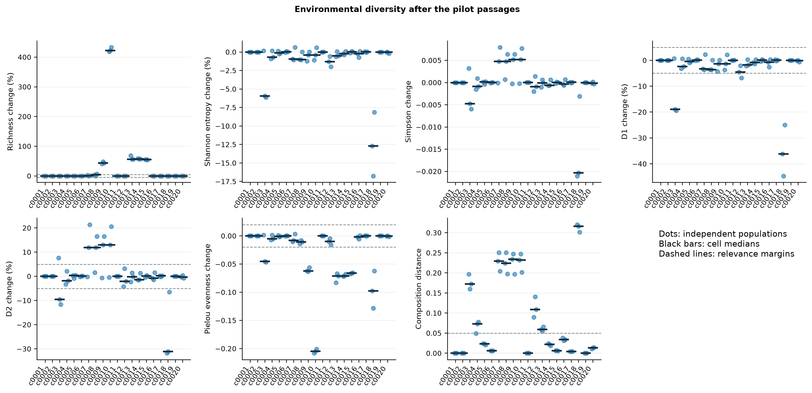
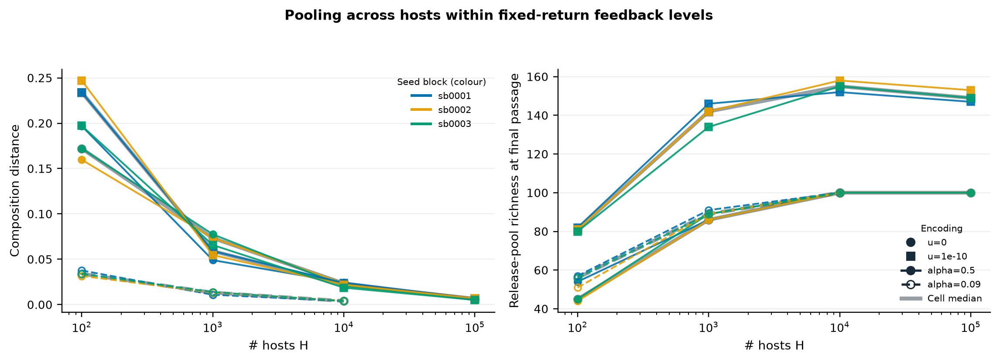
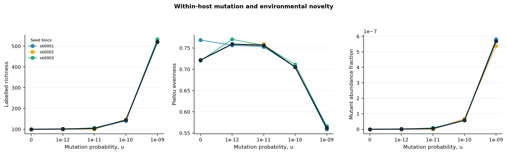
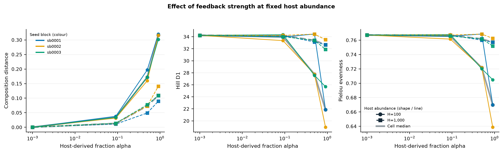
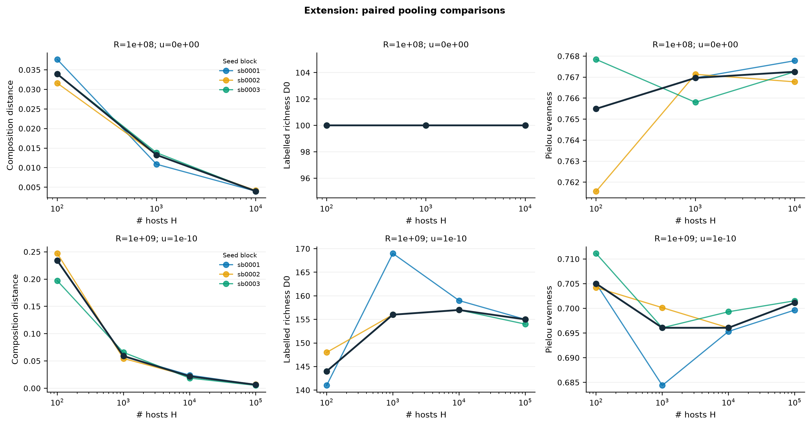
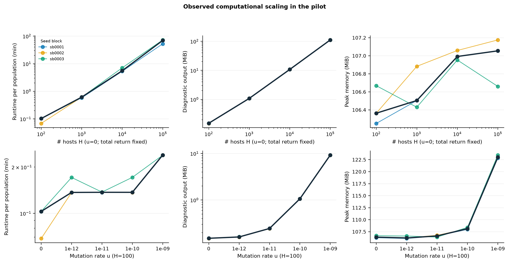

# Phase 1 first-pilot report

**Status:** exploratory pilot report; not a confirmatory analysis  
**Report date:** 2026-08-13  
**Experiment:** `phase1-first-pilot-20cell`

## Purpose and scope

This pilot tested whether the simulation is computationally feasible and whether the selected parameter levels produce informative biological responses. One complete simulated population is the independent replicate. The pilot does not establish equilibrium or provide confirmatory tests.

## Pilot design

| Cell | Main purpose | # hosts H | Escape fraction f | Escapees/host e | Total return R | Host fraction alpha | Mutation rate u |
|---|---|---|---|---|---|---|---|
| c0001 | No-return baseline | 100 | 0 | 0 | 0 | 0 | 0 |
| c0002 | Mutation occurs in hosts but nothing returns | 100 | 0 | 0 | 0 | 0 | 1.00e-10 |
| c0003 | Fixed-return, feedback comparison | 100 | 0.01 | 10,000,000 | 1.00e+09 | 0.5 | 0 |
| c0004 | Fixed-return, pooling comparison | 1,000 | 0.001 | 1,000,000 | 1.00e+09 | 0.5 | 0 |
| c0005 | Fixed-return, pooling comparison | 10,000 | 1.00e-04 | 100,000 | 1.00e+09 | 0.5 | 0 |
| c0006 | Fixed-return, pooling comparison | 100,000 | 1.00e-05 | 10,000 | 1.00e+09 | 0.5 | 0 |
| c0007 | Lowest positive mutation level | 100 | 0.01 | 10,000,000 | 1.00e+09 | 0.5 | 1.00e-12 |
| c0008 | Low mutation | 100 | 0.01 | 10,000,000 | 1.00e+09 | 0.5 | 1.00e-11 |
| c0009 | Intermediate mutation, pooling comparison | 100 | 0.01 | 10,000,000 | 1.00e+09 | 0.5 | 1.00e-10 |
| c0010 | High mutation | 100 | 0.01 | 10,000,000 | 1.00e+09 | 0.5 | 1.00e-09 |
| c0011 | feedback comparison | 100 | 1.00e-05 | 10,000 | 1.00e+06 | 9.99e-04 | 0 |
| c0012 | Strong feedback boundary | 1,000 | 0.01 | 10,000,000 | 1.00e+10 | 0.909 | 0 |
| c0013 | Intermediate mutation, pooling comparison | 1,000 | 0.001 | 1,000,000 | 1.00e+09 | 0.5 | 1.00e-10 |
| c0014 | Intermediate mutation, pooling comparison | 10,000 | 1.00e-04 | 100,000 | 1.00e+09 | 0.5 | 1.00e-10 |
| c0015 | Intermediate mutation, pooling comparison | 100,000 | 1.00e-05 | 10,000 | 1.00e+09 | 0.5 | 1.00e-10 |
| c0016 | Weaker fixed-return, pooling comparison; feedback comparison | 100 | 0.001 | 1,000,000 | 1.00e+08 | 0.091 | 0 |
| c0017 | Weaker fixed-return, pooling comparison | 10,000 | 1.00e-05 | 10,000 | 1.00e+08 | 0.091 | 0 |
| c0018 | feedback comparison | 100 | 0.1 | 100,000,000 | 1.00e+10 | 0.909 | 0 |
| c0019 | More hosts feedback comparison | 1,000 | 1.00e-06 | 1,000 | 1.00e+06 | 9.99e-04 | 0 |
| c0020 | Weaker fixed-return, pooling comparison; More hosts, feedback comparison | 1,000 | 1.00e-04 | 100,000 | 1.00e+08 | 0.091 | 0 |

**Colour key in the PDF:** grey marks baseline/reference purposes; purple shades distinguish the host-number H comparisons; blue shades mark the feedback-alpha comparisons; and green marks the mutation-rate u comparison. Coloured text identifies cells that also belong to another comparison series. The wording and colour assignments reproduce slide 28 of the project update.

## Biological results

- No-return controls left the environmental composition exactly unchanged.
- At fixed total return, increasing host number from 100 to 100,000 changed the median composition distance from 0.1721 to 0.0059. Total return alone therefore did not determine the short-term response.
- At the highest mutation level (1e-09), median labelled richness was 522, but the median mutant abundance fraction was only 5.69e-07. Mutation created many rare labels rather than abundant new types.
- Across the fixed-H feedback series, increasing alpha from about 0.001 to 0.909 produced these endpoint changes (H=100: median TV 4.110e-04 to 0.3163, median D1 34.2 to 21.9; H=1,000: median TV 1.416e-04 to 0.1089, median D1 34.2 to 32.7).

### Summary of biological effects

| Comparison | Diversity / composition | Richness D0 | Evenness | Main interpretation |
|---|---|---|---|---|
| No return (c0001, c0002) | No change | No change | No change | With f=0, within-host events cannot affect the environment. |
| Host return, u=0 (c0003) | Redistribution (median TV 0.172); abundance-weighted change varies by seed block. | No change | Median decrease at H=100; seed-block dependent. | A small number of independent host samples can amplify an unrepresentative infection pool. |
| Increase H, fixed R, u=0 (c0003, c0004, c0005, c0006) | Redistribution falls (median TV 0.172 to 0.006). | No change in this mutation-free series | Returns toward the initial value in two of three seed blocks. | At R=1e9, H controls averaging across independent infections; u was fixed at zero. |
| Increase u (c0003, c0007, c0008, c0009, c0010) | Composition changes; median D1 and D2 increase, but direction is seed-block dependent. | Strong increase (100 to 522) | Decreases as rare mutant labels accumulate | The u dose-response was measured at H=100; the extension adds an exploratory H by u comparison. |
| Increase alpha, H=100 (c0011, c0016, c0003, c0018) | Redistribution increases overall (median TV 4.110e-04 to 0.3163); median D1 34.2 to 21.9. | No change (median D0 100 throughout). | Median 0.767 to 0.670. | H and u are fixed; f, R and alpha increase together. The alpha=0.909 endpoint uses f=0.1, outside the primary range. |
| Increase alpha, H=1,000 (c0019, c0020, c0004, c0012) | Redistribution increases overall (median TV 1.416e-04 to 0.1089); median D1 34.2 to 32.7. | No change (median D0 100 throughout). | Median 0.767 to 0.757. | H and u are fixed; f, R and alpha increase together. The alpha=0.001 endpoint uses f=1e-6, outside the primary range. |
| Lower-return pooling (c0016, c0020, c0017) | Redistribution falls (median TV 0.034 to 0.004). | No change (median D0 100 throughout). | Negligible net change (median 0.765 to 0.767). | At R=1e+08 and u=0, pooling across more hosts still reduces redistribution; 3 H levels were tested. |
| Mutation-enabled pooling (c0009, c0013, c0014, c0015) | Redistribution falls (median TV 0.234 to 0.006). | Moderate, non-monotonic increase (median D0 144-157; 155 at highest H). | Small, non-monotonic change (median 0.696-0.705). | Alongside the mutation-free R=1e9 series, this explores H by u: redistribution falls in both, while rare mutant labels remain. |

The three seed blocks are matched across cells. Comparisons therefore use within-seed changes: each coloured line in the comparison figures joins the same seed block across parameter levels. Black lines show cell medians. With only three blocks, these are descriptive paired patterns, not hypothesis tests.

### Endpoint diversity indices

Values are cell medians across independent population replicates.

| Cell | D0 | Shannon H' | Simpson | D1 | D2 | Evenness | TV |
|---|---|---|---|---|---|---|---|
| c0001 | 100 | 3.533 | 0.95497 | 34.228 | 22.206 | 0.7672 | 0 |
| c0002 | 100 | 3.533 | 0.95497 | 34.228 | 22.206 | 0.7672 | 0 |
| c0003 | 100 | 3.3237 | 0.95018 | 27.762 | 20.072 | 0.7217 | 0.1721 |
| c0004 | 100 | 3.5085 | 0.9541 | 33.398 | 21.788 | 0.7619 | 0.0734 |
| c0005 | 100 | 3.5285 | 0.95513 | 34.073 | 22.287 | 0.7662 | 0.0234 |
| c0006 | 100 | 3.5333 | 0.955 | 34.237 | 22.224 | 0.7673 | 0.0059 |
| c0007 | 101 | 3.4996 | 0.95974 | 33.101 | 24.838 | 0.7591 | 0.2295 |
| c0008 | 104 | 3.4965 | 0.95974 | 32.999 | 24.837 | 0.7562 | 0.2242 |
| c0009 | 144 | 3.5192 | 0.96014 | 33.756 | 25.09 | 0.705 | 0.2341 |
| c0010 | 522 | 3.5192 | 0.96014 | 33.757 | 25.091 | 0.5624 | 0.2321 |
| c0011 | 100 | 3.5331 | 0.95497 | 34.229 | 22.207 | 0.7672 | 4.110e-04 |
| c0012 | 100 | 3.4865 | 0.95401 | 32.672 | 21.746 | 0.7571 | 0.1089 |
| c0013 | 156 | 3.515 | 0.95486 | 33.617 | 22.155 | 0.6961 | 0.059 |
| c0014 | 157 | 3.5246 | 0.95431 | 33.939 | 21.888 | 0.6961 | 0.0219 |
| c0015 | 155 | 3.5336 | 0.955 | 34.247 | 22.221 | 0.7011 | 0.0065 |
| c0016 | 100 | 3.5252 | 0.95462 | 33.961 | 22.038 | 0.7655 | 0.0339 |
| c0017 | 100 | 3.5333 | 0.95505 | 34.238 | 22.246 | 0.7673 | 0.004 |
| c0018 | 100 | 3.0842 | 0.93466 | 21.85 | 15.304 | 0.6697 | 0.3163 |
| c0019 | 100 | 3.5331 | 0.95497 | 34.228 | 22.206 | 0.7672 | 1.416e-04 |
| c0020 | 100 | 3.532 | 0.9548 | 34.192 | 22.125 | 0.767 | 0.0133 |

### Host pooling within fixed-return series

Colours identify matched seed blocks. Circles show u=0 and squares show u=1e-10. Filled markers with solid lines show alpha=0.5; hollow markers with dashed lines show alpha=0.09. The thicker black underlays show cell medians.

### Within-host mutation

Coloured lines connect the same seed block across u; the black line is the cell median.

### Feedback strength at fixed host abundance

The same four alpha levels are evaluated separately at H=100 and H=1,000. Within each series H and u are fixed, while f, total return R and alpha increase together. Lines connect the same seed block. The extreme f values used for c0018 and c0019 are sensitivity levels outside the primary escape-rate range.

### Extension pooling comparisons

The extension completes the mutation-enabled R=10^9 series and the mutation-free R=10^8 series. Lines connect the same seed block.

## Quality control and computational feasibility

The analysis included 60 populations across 20 cells. The endpoint audit result was **PASS**. Summed runtime was 10.92 hours, diagnostic output was 4259.2 MiB, and maximum measured process-tree memory was 578.9 MiB. Every pilot run used two worker processes, five host passages and 500 steady within-host bacterial generations.

Benchmark machine: Local Mac: 1.2 GHz quad-core Intel Core i7 with 8 GB RAM. Timings should be recalibrated with a small batch on the target HPC before the larger experiment is launched.

| # hosts H | Median runtime | Median output | Median peak RAM |
|---|---|---|---|
| 100 | 0.10 min | 0.15 MiB | 106.4 MiB |
| 1,000 | 0.62 min | 1.09 MiB | 106.5 MiB |
| 10,000 | 5.57 min | 10.76 MiB | 107.0 MiB |
| 100,000 | 69.99 min | 111.52 MiB | 107.1 MiB |

Within the mutation-free matched-return series, the fitted host-number exponent was 0.95 for runtime and 0.96 for diagnostic output. Thus, a tenfold increase in H multiplied median runtime by about 8.8 and output by about 9.1. Peak RAM was nearly independent of H because host tasks are streamed through a bounded queue.

At H=100, raising u from zero to the highest pilot level multiplied median runtime by 2.3, output by 61.1, and peak RAM by 1.16. This cost comes from materialized mutant lineages and their records.

For this implementation, a useful work model is O(P H [G S + M]), where P is the number of host passages, G is the number of within-host transitions, S is extant strain richness and M is the number of materialized mutation events. The code works with strain counts, not individual bacterial cells. Therefore K, e and R do not create one operation per cell. The independent effect of e cannot be estimated from this pilot because e changes inversely with H in the matched-return series.

**HPC starting allocation:** request two CPUs and 1 GiB RAM for each concurrent population. Begin with 8-16 concurrent populations, inspect CPU use and file-system throughput, then increase toward the CPU limit. With 100 available CPUs and two workers per population, 50 concurrent populations is the CPU ceiling. Rebenchmark before increasing workers, u, retained host detail, or the number of passages. At unchanged output settings, runtime and host-level output should grow roughly linearly with the number of host passages.

## Interpretation and next step

The pilot supports using a longer equilibrium and precision pilot before any confirmatory experiment. Three replicates per cell are sufficient for calibration and graphical ranges, but not for stable confidence intervals or equivalence tests.

## Reproducibility

- Source commit: `7c988b4601dcd19f609667a179b75a3c7c1dd90d`
- Recorded source-tree SHA-256 values: `1bcdb27a877230e831b4fff0e9b86a5a0e623dc199d77ac0ae7779c0032529d9, 716aaa9c6e26f4b4734a99513704bb366ed7c6006a0755f54bf1f9889a2a46db, 8b089c52f5ab083bd18cd643d985235bfbd5917fe2553112d8511bb7c2413995, ab4ab2bdacfe63adfdeed54163b4a1976b417337eab9d65f32ca1880f5a4c4fb, b752885bfd23ae2dcf4f44b22657c3435e2fcd4d676f484ff3689614eaf82cad`
- Seed blocks: `sb0001, sb0002, sb0003`
- Analysis audit: `PASS`
- Multiple source-tree hashes reflect staged reporting, launcher and pilot-design additions. The biological transition modules were unchanged; each population records the exact hash and resolved configuration used.
- Complete numerical results remain in the machine-readable analysis tables.

## Appendix: glossary and diversity measures

- **Relative abundance, pᵢ:** fraction of environmental cells assigned to strain i.
- **Labelled richness, D0:** number of distinct strain labels. Every label counts once, even if it contains only one cell.
- **Shannon entropy, H':** H' = -Σᵢ pᵢ ln(pᵢ). Higher values mean that strain identity is less predictable. It is an index, not an effective number of strains.
- **Simpson diversity:** 1 - Σᵢ pᵢ². This is the probability that two independently sampled cells have different strain labels.
- **Hill D1:** D₁ = exp(H'). The number of equally abundant strains that would give the observed Shannon entropy.
- **Hill D2:** D₂ = 1 / Σᵢ pᵢ². The number of equally abundant strains that would give the observed probability of sampling the same strain twice. It gives more weight to abundant strains than D1.
- **Pielou evenness:** J = H' / ln(D₀). It compares the observed Shannon entropy with the maximum possible value for the observed richness.
- **Composition distance (TV):** TV(A,B) = ½ Σᵢ |pᵢ(A) - pᵢ(B)|. A value of 0.20 means that 20% of abundance must be reassigned among labels to make two compositions identical.
- **Cell:** one defined combination of experimental parameter values.
- **Seed block:** one independently seeded population replicate reused as a reproducible block across cells.
- **H:** number of hosts; **f:** escape fraction per host; **e:** escaping cells per host (fK); **R:** total returned cells (He); **alpha:** fraction of the pre-regulation mixture derived from hosts; **u:** whole-genome mutation probability per bacterial generation.
