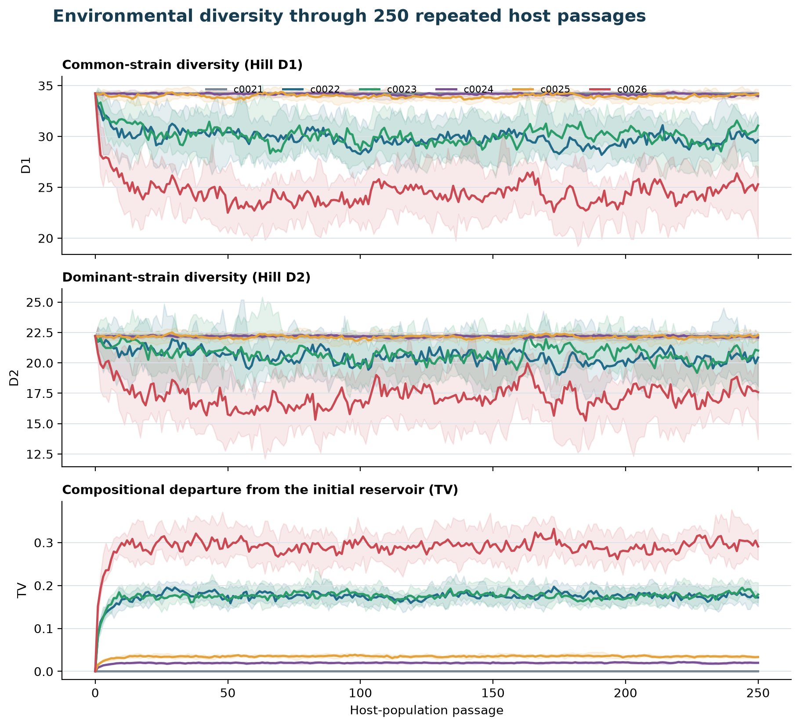
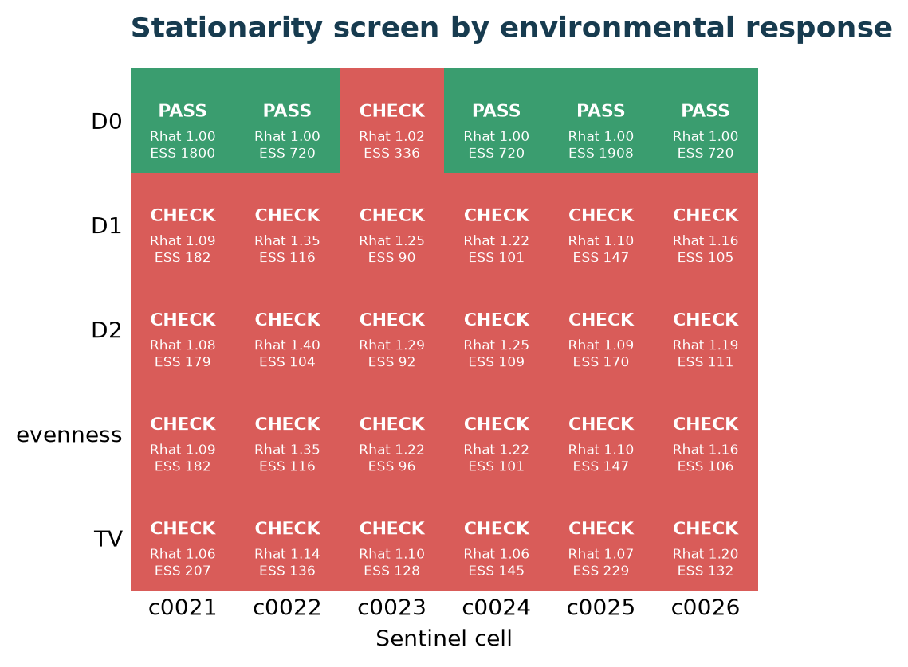
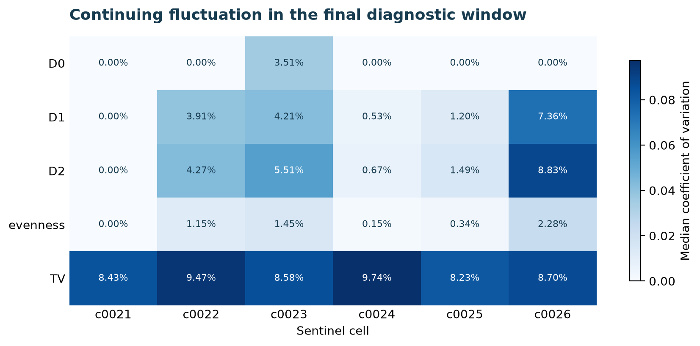
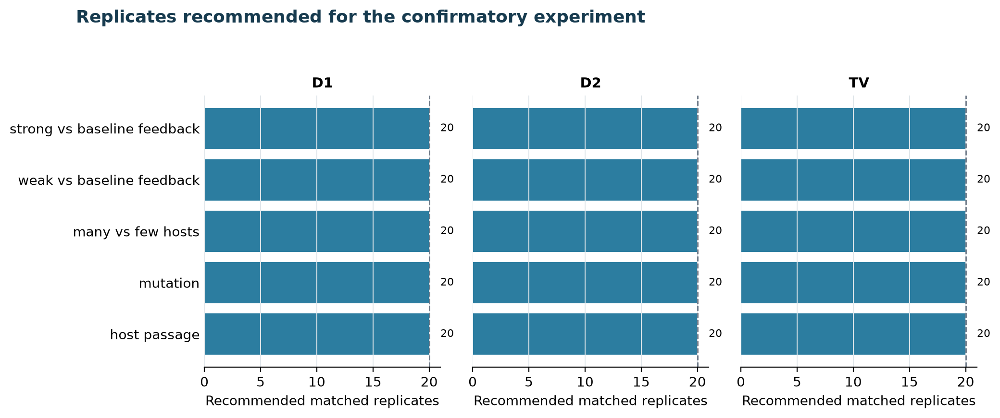

# Phase 1 second pilot: stationarity and precision

**Report date:** 2026-08-27  
**Analysis audit:** `PASS`  
**Populations:** 72 (6 cells x 12 matched seed blocks)  
**Host passages:** 250

## What this pilot asks

This second pilot asks whether environmental diversity appears statistically stable late in a 250-passage run, how much it continues to fluctuate, and how many independent matched replicates a later confirmatory experiment may need.

## Main result

5 of 30 cell-response screens passed; 0 of 6 cells passed all five responses.

Passing this screen supports late-run stationarity, not definitive equilibrium. The experiment starts all runs from the same environmental composition, so it does not test convergence from different starting communities.

## Sentinel conditions

| Cell | Biological role | Hosts | Escape fraction | Total return | Mutation rate | Screen passes | Persistent screen |
|---|---|---:|---:|---:|---:|---:|---:|
| c0021 | no return | 100 | 0 | 0 | 0 | 1/5 | not by 250 |
| c0022 | baseline host passage | 100 | 0.01 | 1,000,000,000 | 0 | 1/5 | not by 250 |
| c0023 | within-host mutation | 100 | 0.01 | 1,000,000,000 | 1e-10 | 0/5 | not by 250 |
| c0024 | host pooling | 10,000 | 0.0001 | 1,000,000,000 | 0 | 1/5 | not by 250 |
| c0025 | weak feedback | 100 | 0.001 | 100,000,000 | 0 | 1/5 | not by 250 |
| c0026 | strong feedback | 100 | 0.1 | 10,000,000,000 | 0 | 1/5 | not by 250 |

**Figure 1.** Lines are medians across 12 independent populations; shaded bands span the 10th to 90th percentiles. TV is total-variation distance from the initial environmental composition.

**Figure 2.** A response passes only when both overlapping late-window assessments satisfy the predeclared equivalence limits, rank-normalized split R-hat is below 1.05, and approximate combined ESS is at least 400.

**Figure 3.** Median within-run coefficient of variation in the last diagnostic window. Larger values mean more continuing fluctuation around the late-run level.

## Precision for the confirmatory experiment

The largest recommendation is 20 matched replicates. Recommendations target a 95% confidence-interval half-width of 0.05, use a minimum of 20 replicates, increase in batches of 8, and are capped at 100.

**Figure 4.** Dashed lines show the minimum of 20 matched replicates.

## Quality control and computational resources

- Analysis audit: `PASS`.
- Summed elapsed time: 33.77 hours.
- Output volume: 7.95 GiB.
- Highest recorded process-tree memory: 106.5 MiB.
- Every run was checked for 251 environmental states, constant reservoir size, migration counts, committed completion metadata, configuration hashes, and final-state checksums.

## Interpretation limits

- Stationarity diagnostics are an initial screen, not proof of equilibrium.
- Convergence from contrasting initial strain compositions is not tested.
- Linear first-pilot cost projections are planning estimates, not guarantees.
- Confirmatory seed blocks must remain held out until final design freeze.

## Short glossary

- **D0:** strain richness; every detected strain counts equally.
- **D1:** effective number of common strains; sensitive to richness and evenness.
- **D2:** effective number of dominant strains; gives more weight to abundant strains.
- **Evenness:** how similarly abundant the strains are.
- **TV:** total-variation distance from the initial environmental composition; 0 means identical and 1 means no overlap.
- **ESS:** effective sample size after accounting for temporal autocorrelation.
- **R-hat:** agreement among independent replicate trajectories after splitting each trajectory; values close to 1 are preferred.
