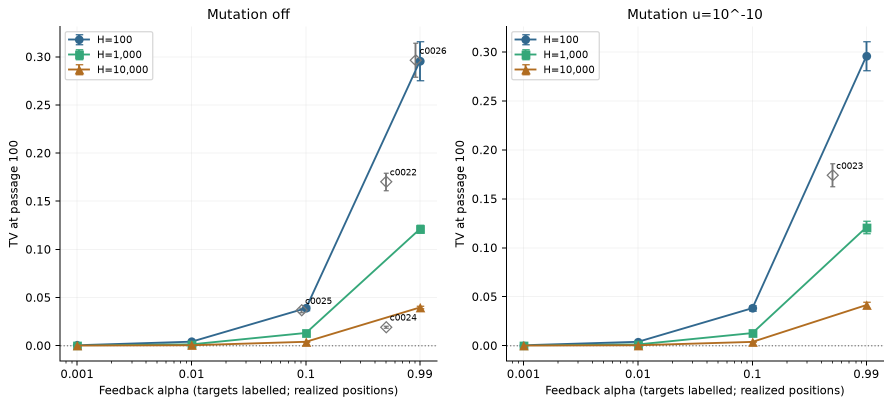
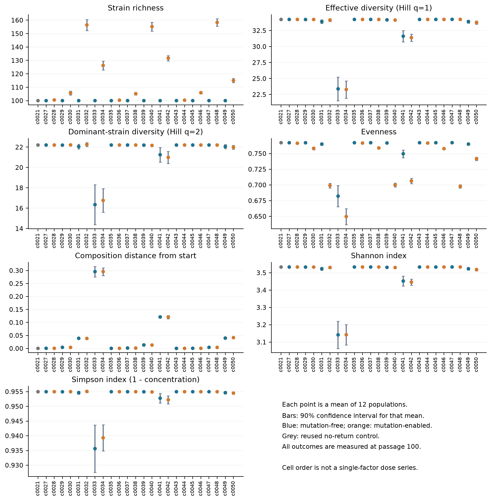
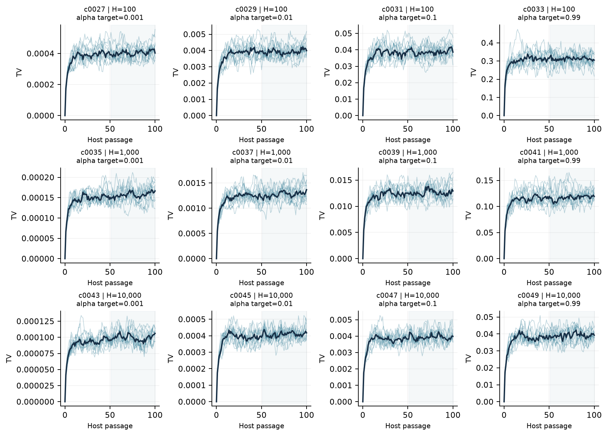
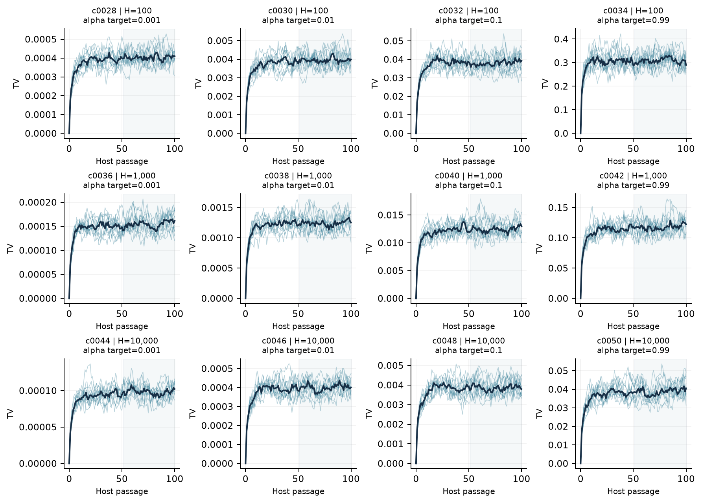
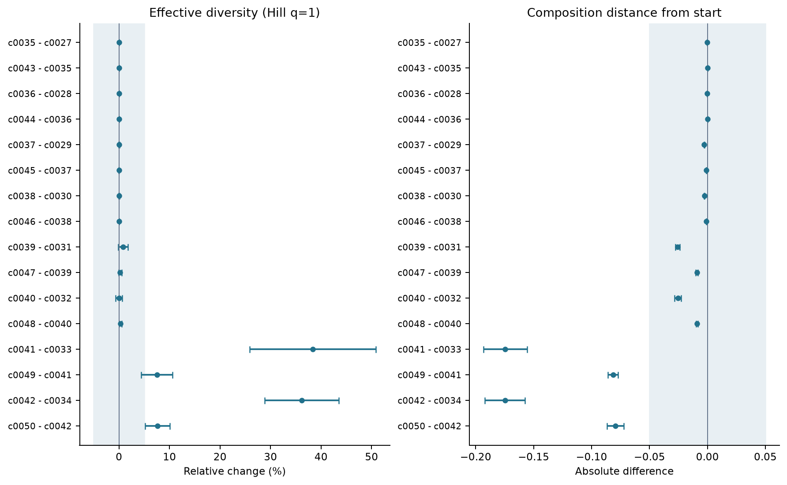
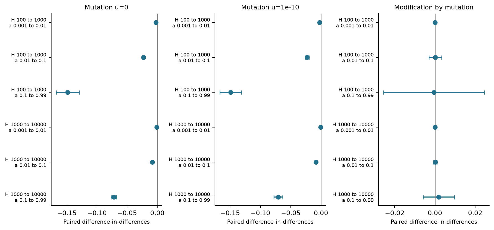

# Phase 1: Stage 3 part one

Report date: 2026-09-01. Audit: `PASS`.

Stage 3 part one contains 24 new conditions and 12 matched seed blocks per condition: 288 new populations. One shared c0021 control contributes 12 reused populations, making 25 primary conditions and 300 primary populations. All outcomes are measured at passage 100. Five off-grid Stage 2 conditions (60 populations) provide supplementary reference points, not grid substitutes. Selection is off in both habitats. The environment receives host returns and 10% replacement from a fixed regional source at each passage. These are finite-time outcomes, not evidence that every condition reached equilibrium.

Richness counts distinct strain labels. Hill q=1 diversity is the number of equally common strains that would give the same Shannon diversity; Hill q=2 gives more weight to common strains. Evenness describes how equally abundance is shared. TV is the fraction of abundance that must be reassigned to recover the starting composition (0 means identical, 1 means entirely different).

## Frozen design

| Cell | # hosts H | Escape f | Mutation u | Alpha target | Alpha realized | Source / escape range |
|---|---:|---:|---:|---:|---:|---|
| c0021 | 100 | 0 | 0 | 0 | 0 | reused-control; no-return-control |
| c0027 | 100 | 0.00001 | 0 | 0.001 | 0.000999000999 | new-grid-cell; primary-range |
| c0028 | 100 | 0.00001 | 1e-10 | 0.001 | 0.000999000999 | new-grid-cell; primary-range |
| c0029 | 100 | 0.000101 | 0 | 0.01 | 0.00999901 | new-grid-cell; primary-range |
| c0030 | 100 | 0.000101 | 1e-10 | 0.01 | 0.00999901 | new-grid-cell; primary-range |
| c0031 | 100 | 0.0011111 | 0 | 0.1 | 0.0999991 | new-grid-cell; primary-range |
| c0032 | 100 | 0.0011111 | 1e-10 | 0.1 | 0.0999991 | new-grid-cell; primary-range |
| c0033 | 100 | 0.99 | 0 | 0.99 | 0.99 | new-grid-cell; above-primary-range |
| c0034 | 100 | 0.99 | 1e-10 | 0.99 | 0.99 | new-grid-cell; above-primary-range |
| c0035 | 1,000 | 0.000001 | 0 | 0.001 | 0.000999000999 | new-grid-cell; below-primary-range |
| c0036 | 1,000 | 0.000001 | 1e-10 | 0.001 | 0.000999000999 | new-grid-cell; below-primary-range |
| c0037 | 1,000 | 0.0000101 | 0 | 0.01 | 0.00999901 | new-grid-cell; primary-range |
| c0038 | 1,000 | 0.0000101 | 1e-10 | 0.01 | 0.00999901 | new-grid-cell; primary-range |
| c0039 | 1,000 | 0.00011111 | 0 | 0.1 | 0.0999991 | new-grid-cell; primary-range |
| c0040 | 1,000 | 0.00011111 | 1e-10 | 0.1 | 0.0999991 | new-grid-cell; primary-range |
| c0041 | 1,000 | 0.099 | 0 | 0.99 | 0.99 | new-grid-cell; above-primary-range |
| c0042 | 1,000 | 0.099 | 1e-10 | 0.99 | 0.99 | new-grid-cell; above-primary-range |
| c0043 | 10,000 | 1e-7 | 0 | 0.001 | 0.000999000999 | new-grid-cell; below-primary-range |
| c0044 | 10,000 | 1e-7 | 1e-10 | 0.001 | 0.000999000999 | new-grid-cell; below-primary-range |
| c0045 | 10,000 | 0.00000101 | 0 | 0.01 | 0.00999901 | new-grid-cell; below-primary-range |
| c0046 | 10,000 | 0.00000101 | 1e-10 | 0.01 | 0.00999901 | new-grid-cell; below-primary-range |
| c0047 | 10,000 | 0.000011111 | 0 | 0.1 | 0.0999991 | new-grid-cell; primary-range |
| c0048 | 10,000 | 0.000011111 | 1e-10 | 0.1 | 0.0999991 | new-grid-cell; primary-range |
| c0049 | 10,000 | 0.0099 | 0 | 0.99 | 0.99 | new-grid-cell; primary-range |
| c0050 | 10,000 | 0.0099 | 1e-10 | 0.99 | 0.99 | new-grid-cell; primary-range |

Alpha is host feedback before regional migration. Total return is exactly matched across H at each target; realized alpha reflects whole-cell rounding. At alpha=0.99, f is 0.99, 0.099 or 0.0099. Extended escape-range cells are labelled.

## Results and uncertainty

Intervals use populations, not passages or individual hosts, as replicates. They are exploratory 90% Student-t intervals, without adjustment for multiple comparisons. The shaded bands mark working biological margins, not null-hypothesis significance thresholds. Relative diversity contrasts are calculated within each matched seed before averaging. Stage 2 references are frozen passage-100 results from sb0001-sb0012, not additional simulations. A TV contrast compares distances from the start; it does not compare unrelated mutation IDs across simulations.

### Host-feedback TV response (grey diamonds: off-grid references; dotted line: shared control)

### Passage-100 diversity

### Mutation-free trajectories

### Mutation-enabled trajectories

### Matched comparisons

### H-by-feedback TV interactions and their modification by mutation

## Exploratory classifications

| Cell | Relative to the no-return control |
|---|---|
| c0027 | negligible for five measured statistics |
| c0028 | negligible for five measured statistics |
| c0029 | negligible for five measured statistics |
| c0030 | mixed or unresolved |
| c0031 | negligible for five measured statistics |
| c0032 | richness increase evenness decrease |
| c0033 | effective diversity decrease |
| c0034 | richness increase evenness decrease |
| c0035 | negligible for five measured statistics |
| c0036 | negligible for five measured statistics |
| c0037 | negligible for five measured statistics |
| c0038 | mixed or unresolved |
| c0039 | negligible for five measured statistics |
| c0040 | richness increase evenness decrease |
| c0041 | mixed or unresolved |
| c0042 | richness increase evenness decrease |
| c0043 | negligible for five measured statistics |
| c0044 | negligible for five measured statistics |
| c0045 | negligible for five measured statistics |
| c0046 | mixed or unresolved |
| c0047 | negligible for five measured statistics |
| c0048 | richness increase evenness decrease |
| c0049 | negligible for five measured statistics |
| c0050 | richness increase evenness decrease |

Mixed or unresolved does not mean no effect. Negligible means equivalence only for the five measured statistics, not identity of entire communities.

## What to do next

4 cell-response means have interval half-widths larger than their working precision margin.

Inspect these cells for additional seeds. Fit response surfaces separately for mutation-free and mutation-enabled cells, using whole-cell held-out validation before selecting new parameter combinations. Do not launch adaptive additions automatically. Tail summaries for passages 51-100 describe ongoing fluctuations. The paired mean-TV change from passages 51-75 to 76-100 flags cells for time-horizon review; this is not a complete stationarity or equilibrium test. Keep raw outputs until analysis and archiving have been checked.

Each interaction subtracts the feedback effect at smaller H from the feedback effect at larger H, within the same seed. Negative values in the first two panels mean feedback changes TV less at larger H. The third panel subtracts the mutation-free interaction from the mutation-enabled interaction. These exploratory 90% intervals have no assigned biological equivalence threshold.

## Appendix: diversity glossary

For strain frequencies p_i: Shannon = -sum(p_i ln p_i), using natural logarithms. Hill D1 = exp(Shannon). Simpson = 1 - sum(p_i squared), the probability that two independent draws have different labels. Hill D2 = 1 / sum(p_i squared). Pielou evenness = Shannon / ln(D0) for D0 > 1. TV = half the sum of absolute frequency differences across the union of labels; absent strains have frequency zero. D0 counts labels; ancestral diversity merges mutant descendants with their founding strain.
