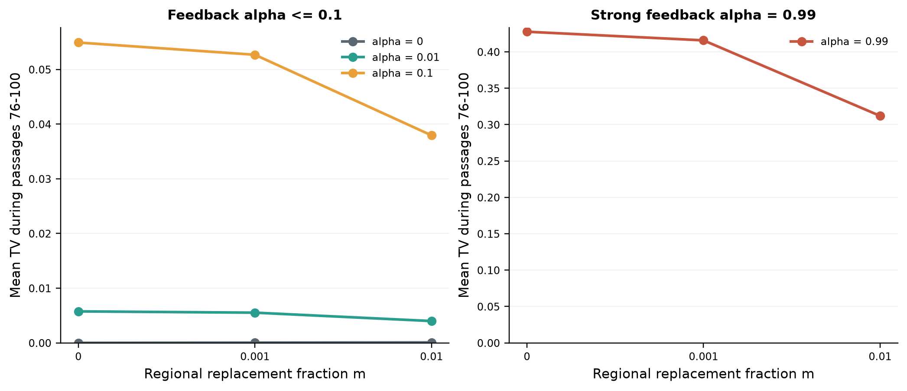
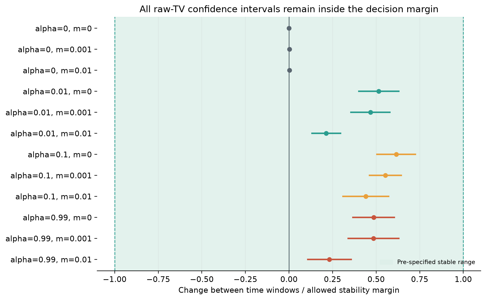

# Phase 1 Stage 3 Wave 2 passage-100 adaptive-decision report

## Main conclusion

All 21 raw-TV and host-induced-TV diagnostics met the pre-specified stability rule at passage 100. Six pre-specified anchor conditions (c0063, c0064, c0065, c0077, c0078, c0079) nevertheless continue to passage 500, representing 72 populations.

Stable means that the paired 90% interval for continuing change remained inside the chosen biological margin. It does not mean that every trajectory was flat or that equilibrium has been demonstrated.

## Scope

The repository contains the frozen adaptive decision, its 21 diagnostics and fingerprints for all 408 new trajectories, but not the derived endpoint tables needed for the complete H-by-B and alpha-by-m scientific report.

## Late-window environmental displacement

Regional replacement reduced the late-window host signal over the three low-migration values used for the adaptive decision. The complete migration surface is not available in the pulled summaries.

## Stability diagnostics

| Cell | alpha | m | Late mean TV | Window change | 90% interval | Margin |
|---|---:|---:|---:|---:|---:|---:|
| c0063 | 0 | 0 | 0.000000 | 0.000000 | [0.000000, 0.000000] | 0.002000 |
| c0064 | 0 | 0.001 | 0.000037 | 0.000005 | [0.000004, 0.000007] | 0.002000 |
| c0065 | 0 | 0.01 | 0.000084 | 0.000007 | [0.000005, 0.000009] | 0.002000 |
| c0070 | 0.01 | 0 | 0.005758 | 0.001030 | [0.000800, 0.001260] | 0.002000 |
| c0071 | 0.01 | 0.001 | 0.005525 | 0.000935 | [0.000711, 0.001159] | 0.002000 |
| c0072 | 0.01 | 0.01 | 0.003990 | 0.000427 | [0.000265, 0.000590] | 0.002000 |
| c0077 | 0.1 | 0 | 0.054925 | 0.008447 | [0.006938, 0.009957] | 0.013731 |
| c0078 | 0.1 | 0.001 | 0.052688 | 0.007287 | [0.006085, 0.008488] | 0.013172 |
| c0079 | 0.1 | 0.01 | 0.037952 | 0.004185 | [0.002945, 0.005426] | 0.009488 |
| c0084 | 0.99 | 0 | 0.427708 | 0.051922 | [0.039175, 0.064670] | 0.106927 |
| c0085 | 0.99 | 0.001 | 0.415836 | 0.050405 | [0.035295, 0.065515] | 0.103959 |
| c0086 | 0.99 | 0.01 | 0.312006 | 0.018113 | [0.008445, 0.027780] | 0.078001 |

## Frozen continuation

Only the alpha=0 and alpha=0.1 anchors at m=0, 0.001 and 0.01 continue to passage 500. Optional alpha=0.01 and alpha=0.99 cells were not extended because neither their raw nor control-adjusted diagnostics failed.

## Limitation

This adaptive report cannot answer the primary H-by-B comparison, the complete alpha-by-m interaction, or diversity/evenness responses. Those analyses require the HPC scratch outputs or portable derived endpoint tables.
